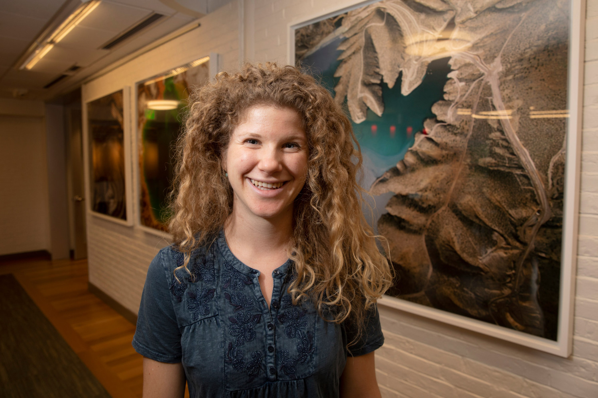
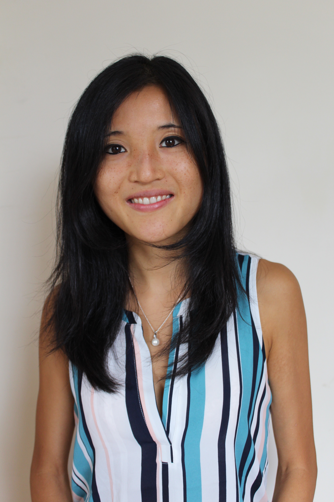
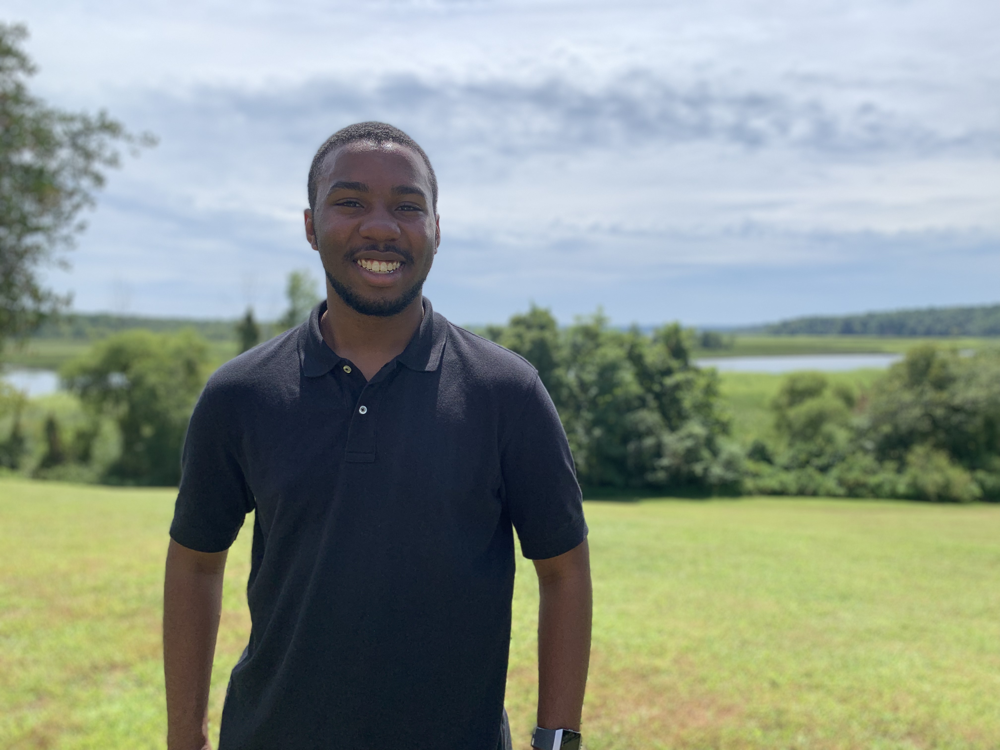
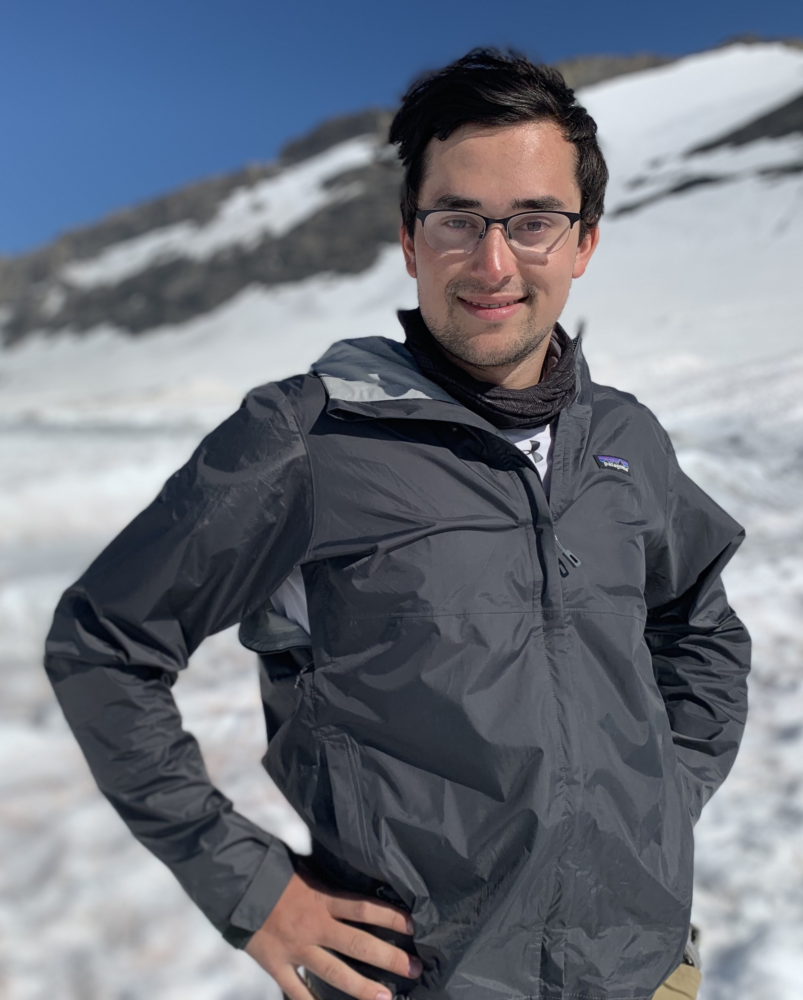
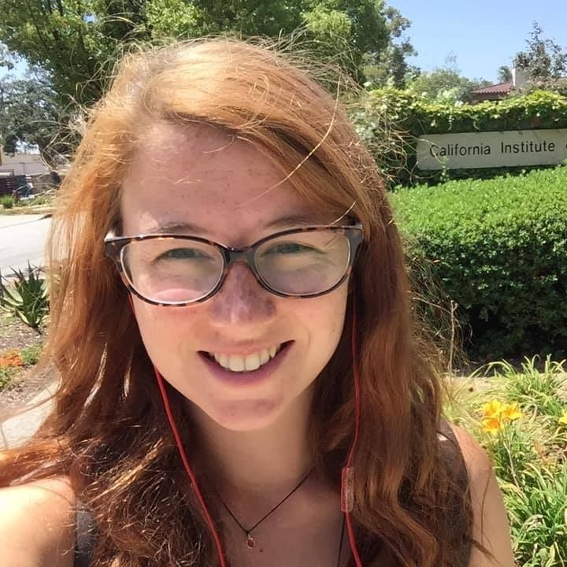
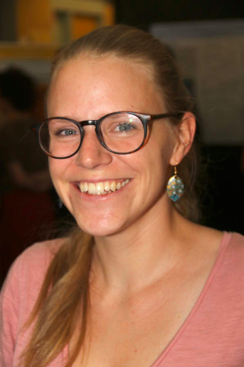

# Welcome to GeoContext! 

## Our Goal
Creating a diverse new generation of geoscientists begins at the training stage. In undergraduate courses, early geoscientists are often glorified and discussed in terms of intellectual achievements, strong personalities, or heated debates. Nevertheless, the social and political backdrop for these scientists was complicated: the development of geology as a discipline is intertwined with the history of imperialism, colonialism, and Westward Expansion in the United States. Such topics are rarely discussed in current geoscience courses, and continuing to train the next generation of geoscientists without regard to this history perpetuates the same practices of exclusion. This is particularly important as co-production — developing knowledge and science together with local communities — is increasingly gaining attention and recognition today. Now, more than ever, there is a real need for historical literacy to be an integral part of STEM curriculum and training.

Here we present a resource to assist educators in integrating topics on racism, colonialism, imperialism, environmental damage, and exploitation of natural resources into subjects commonly taught within geoscience departments. This resource consists of modular lecture slides with accompanying lecture notes, suggested discussion questions, and further reading to promote in-class engagement. This resource is freely available and geared towards flexibility so that rather than being a standalone course, it allows educators to pick and choose content for incorporation into their existing lectures. Topics available include plate tectonics, geomorphology, glaciology, and volcanology. For each topic, we discuss the imperialist nature of the sciences in the 19th and 20th century and link it to social inequalities today, with a particular focus on the overlooked contributions of early geology to scientific racism.

Ultimately, we hope this work ignites energy towards a reimagined curriculum in the Earth sciences. This curriculum incorporates a social context for the geosciences, past and present, in order to provide a holistic base of knowledge that empowers students to recognize and navigate existing structures of oppression within geoscience and society at large.

## Teaching Modules

#### Oceanography and the Slave Trade
<a href="GeoContext/GeoContext - Oceanography and the Slave Trade.pptx" download>PowerPoint</a>
<a href="GeoContext/GeoContext - Oceanography and the Slave Trade.pdf" download>Companion Document</a>
#### Landscapes and Scientific Racism
#### Isostasy and Colonialism
#### Glaciology, Race, and Masculinity
<a href="GeoContext/GeoContext - Glaciology, Race, and Masculinity.pptx" download>PowerPoint</a>
<a href="GeoContext/GeoContext - Glaciology, Race, and Masculinity.pdf" download>Companion Document</a>

## Teaching Philosophy

<a href="GeoContext/GeoContext - Teaching Philosophy.pdf" download>Click to Download</a>

## The Team

 Tamara Pico  
 (they/them/she/her), Postdoctoral Fellow, Division of Geological and Planetary Sciences, Caltech, ice age sea level change and landscape evolution 

 Christine Y. Chen   
 (she/her), Postdoctoral Fellow, Division of Geological and Planetary Sciences, California Institute of Technology, quaternary geology and geochronology 

 Harriet Lau  
 (she/her), Assistant Professor, Earth and Planetary Science, UC Berkeley, global geodynamics 

 John Wesley Wiggins  
 (he/him), Undergraduate Student, Department of Geosciences, Princeton University 

 Seth Olinger  
  (he/him/they/them), PhD candidate, Earth & Planetary Sciences, Harvard University,  ice shelf rifting and seismology 
 
 
Ery Hughes  
  she/her, Postdoctoral Fellow, Division of Geological and Planetary Sciences, Caltech, isotope geochemistry and volcanology 

 
Jacky Austermann  
 (she/her), Assistant Professor, Lamont-Doherty Earth Observatory, Columbia University, sea level change and geodynamics 

 
Claire Jasper  
(she/her), graduate student, Lamont-Doherty Earth Observatory, Columbia University, Antarctica, ice rafted debris, sediment cores, machine learning 

Marisa Borreggine  
(she/her), PhD candidate, Earth & Planetary Sciences, Harvard University, paleoceanography and human migration 

