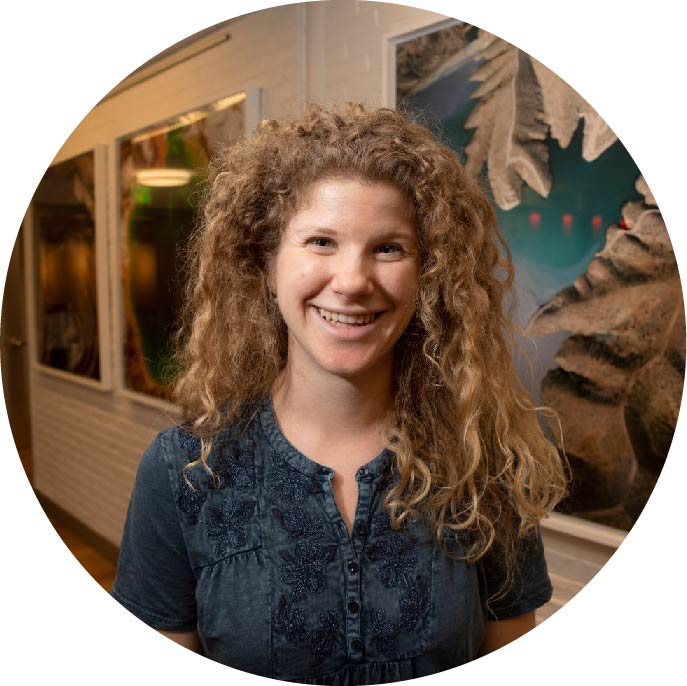

# Welcome to GeoContext!

## Our Goal

## Teaching Resources

## The Team

 

Tamara Pico  
 (they/them/she/her), Postdoctoral Fellow, Division of Geological and Planetary Sciences, Caltech, ice age sea level change and landscape evolution 

Christine Y. Chen   
 (she/her), Postdoctoral Fellow, Division of Geological and Planetary Sciences, California Institute of Technology, quaternary geology and geochronology 

 
Harriet Lau  
 (she/her), Assistant Professor, Earth and Planetary Science, UC Berkeley, global geodynamics 

 Seth Olinger  
  (he/him/they/them), PhD candidate, Earth & Planetary Sciences, Harvard University,  ice shelf rifting and seismology 
 
 
Ery Hughes  
  she/her, Postdoctoral Fellow, Division of Geological and Planetary Sciences, Caltech, isotope geochemistry and volcanology 

 
Jacky Austermann  
 (she/her), Assistant Professor, Lamont-Doherty Earth Observatory, Columbia University, sea level change and geodynamics 

Marisa Borreggine (she/her), PhD candidate, Earth & Planetary Sciences, Harvard University, paleoceanography and human migration

